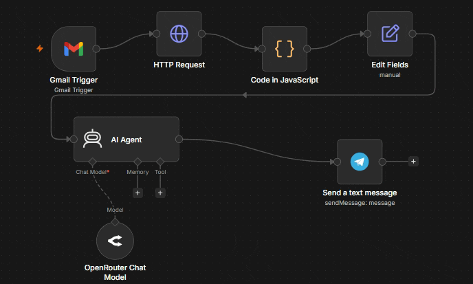

<h1 align="center">n8n Gmail AI Assistant</h1>

An AI-powered email assistant built with **n8n**.

The workflow automatically monitors incoming Gmail messages, analyzes them using a Large Language Model (LLM), and sends an AI-generated summary, priority assessment, and suggested reply directly to Telegram.

## Demo

<p align="center">
  
</p>

## Features

- Automatically monitor incoming Gmail messages.
- Retrieve and clean full email content for accurate AI analysis.
- Generate AI-powered summaries and extract key information.
- Classify email priority and assess spam likelihood.
- Deliver structured email insights directly to Telegram.

## Workflow

1. Gmail Trigger detects a new incoming email.

2. Gmail API retrieves the complete email content.

3. JavaScript processing extracts and cleans the email body.

4. AI Agent analyzes the cleaned email and generates structured insights.

5. Telegram delivers the AI-generated analysis to the user.

## Technologies

- n8n
- Gmail API
- OpenRouter
- Large Language Models (LLMs)
- Telegram Bot API
- JavaScript


## Setup

### Prerequisites

- n8n
- Gmail account
- OpenRouter account
- Telegram Bot

### Configuration

1. Clone this repository.

```bash
git clone https://github.com/<your-username>/gmail-ai-assistant.git
```

2. Import the workflow into n8n.

3. Configure the following credentials:

- Gmail OAuth2
- OpenRouter API
- Telegram Bot API

4. Update the Telegram Chat ID.

5. Activate the workflow.

## Future Improvements

- [x] Read the full email body instead of using the Gmail snippet.
- [x] Improve HTML parsing and email content cleaning.
- [ ] Support one-click AI-generated replies directly from Telegram.
- [ ] Classify emails into categories (work, personal, promotions, etc.).
- [ ] Add calendar event creation for meeting requests.
- [ ] Use a paid LLM API to improve response quality and reliability.
- [ ] Add memory to maintain context from previous email conversations.


## Changelog

### v0.3.0
- Added email content cleaning to remove unnecessary footer sections and promotional boilerplate.
- Improved AI analysis quality by providing cleaner email content.

### v0.2.0
- Read the full Gmail email body instead of using only the snippet.
- Improved email content extraction and cleaning.
- Enhanced AI prompt for more structured email analysis.

### v0.1.0
- Gmail Trigger integration.
- AI email analysis.
- Telegram notifications.


## License

This project is licensed under the MIT License.
